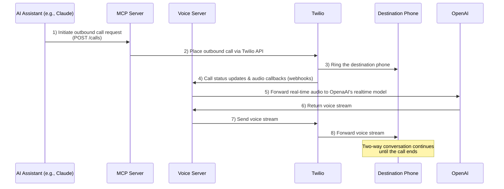

# Voice Call MCP Server

A Model Context Protocol (MCP) server that enables Claude and other AI assistants to initiate and manage voice calls using Twilio and OpenAI.

Use this as a base to kick-start your AI-powered voice calling explorations, save time and develop additional functionality on top of it.


## Sequence Diagram




## Features

- Make outbound phone calls via Twilio 📞
- Process call audio in real-time with OpenAI 🎙️
- Pre-built prompts for common calling scenarios (like restaurant reservations) 🍽️
- Automatic public URL tunneling with ngrok 🔄
- Secure handling of credentials 🔒

## Why MCP?

The Model Context Protocol (MCP) bridges the gap between AI assistants and real-world actions. By implementing MCP, this server allows AI models like Claude to:

1. Initiate actual phone calls on behalf of users
2. Process and respond to real-time audio conversations
3. Execute complex tasks requiring voice communication

This open-source implementation provides transparency and customizability, allowing developers to extend functionality while maintaining control over their data and privacy.

## Requirements

- Node.js >= 22
  - If you need to update Node.js, we recommend using `nvm` (Node Version Manager):
    ```bash
    nvm install 22
    nvm use 22
    ```
- Twilio account with API credentials
- OpenAI API key
- Ngrok Authtoken

## Installation

### Manual Installation

1. Clone the repository
   ```bash
   git clone https://github.com/lukaskai/mcp-new.git
   cd mcp-new
   ```

2. Install dependencies and build
   ```bash
   npm install
   npm run build
   ```

## Configuration

The server requires several environment variables:

- `TWILIO_ACCOUNT_SID`: Your Twilio account SID
- `TWILIO_AUTH_TOKEN`: Your Twilio auth token
- `TWILIO_NUMBER`: Your Twilio number
- `OPENAI_API_KEY`: Your OpenAI API key
- `NGROK_AUTHTOKEN`: Your ngrok authtoken
- `RECORD_CALLS`: Set to "true" to record calls (optional)

### Claude Desktop Configuration

To use this server with Claude Desktop, add the following to your configuration file:

**macOS**: `~/Library/Application Support/Claude/claude_desktop_config.json`

**Windows**: `%APPDATA%\Claude\claude_desktop_config.json`

```json
{
  "mcpServers": {
    "voice-call": {
      "command": "node",
      "args": ["/path/to/your/mcp-new/dist/start-all.cjs"],
      "env": {
        "TWILIO_ACCOUNT_SID": "your_account_sid",
        "TWILIO_AUTH_TOKEN": "your_auth_token",
        "TWILIO_NUMBER": "your_e.164_format_number",
        "OPENAI_API_KEY": "your_openai_api_key",
        "NGROK_AUTHTOKEN": "your_ngrok_authtoken"
      }
    }
  }
}
```

After that, restart Claude Desktop to reload the configuration. 
If connected, you should see Voice Call under the 🔨 menu.

## Example Interactions with Claude

Here are some natural ways to interact with the server through Claude:

1. Simple call:
```
Can you call +11234567890 and let them know I'll be 15 minutes late for our meeting?
```

2. Restaurant reservation:
```
Please call Delicious Restaurant at +11234567890 and make a reservation for 4 people tonight at 7:30 PM.
```

3. Appointment scheduling:
```
Call my dentist at +11234567890 and schedule a cleaning appointment for sometime next week Mon-Thu anytime between 4PM and 6PM.
```

## Important Notes

1. **Phone Number Format**: All phone numbers must be in E.164 format (e.g., +11234567890)
2. **Rate Limits**: Be aware of your Twilio and OpenAI account's rate limits and pricing
3. **Voice Conversations**: The AI will handle natural conversations in real-time
4. **Call Duration**: Be mindful of call durations as they affect OpenAI API and Twilio costs
5. **Public Exposure**: Be aware that the ngrok tunnel exposes your server publicly for Twilio to reach it (though with a random URL and protected by a random secret)

## Troubleshooting

Common error messages and solutions:

1. "Phone number must be in E.164 format"
   - Make sure the phone number starts with "+" and the country code

2. "Invalid credentials"
   - Double-check your TWILIO_ACCOUNT_SID and TWILIO_AUTH_TOKEN. You can copy them from the [Twilio Console](https://console.twilio.com)

3. "OpenAI API error"
   - Verify your OPENAI_API_KEY is correct and has sufficient credits

4. "Ngrok tunnel failed to start"
   - Ensure your NGROK_AUTHTOKEN is valid and not expired

5. "OpenAI Realtime does not detect the end of voice input, or is lagging."
   - Sometimes, there might be voice encoding issues between Twilio and the receiver's network operator. Try using a different receiver.

## Contributing

Contributions are welcome! Here are some areas we're looking to improve:

- Implement support for multiple AI models beyond the current implementation
- Add database integration to store conversation history locally and make it accessible for AI context
- Improve latency and response times to enhance call experiences
- Enhance error handling and recovery mechanisms
- Add more pre-built conversation templates for common scenarios
- Implement improved call monitoring and analytics

If you'd like to contribute, please open an issue to discuss your ideas before submitting a pull request.

## License

This project is licensed under the MIT License - see the LICENSE file for details.

## Security

Please do not include any sensitive information (like phone numbers or API credentials) in GitHub issues or pull requests. This server handles sensitive communications; deploy it responsibly and ensure all credentials are kept secure.


## Looking for a New Opportunity?

🍿 We're hiring talented developers to join our team, innovate in the AI voice and telecommunications space, and hustle alongside us.

Visit [careers.popcorn.space](https://careers.popcorn.space) to see our open positions!
