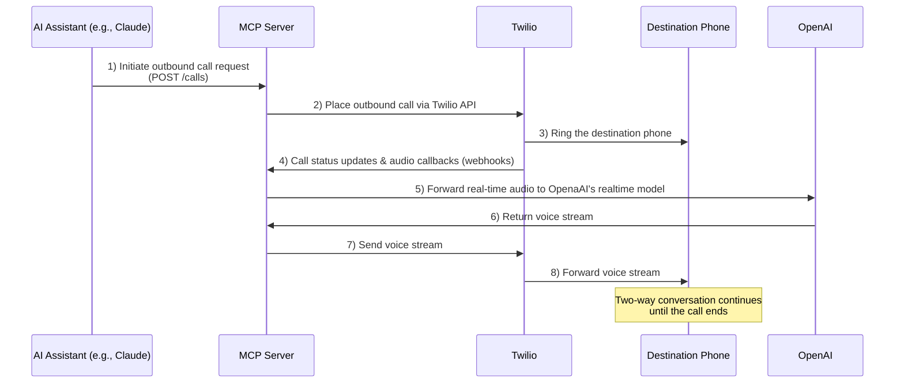

# Voice Call MCP Server

A Model Context Protocol (MCP) server that enables Claude and other AI assistants to initiate and manage voice calls using Twilio and OpenAI (GPT-4o Realtime model).

Use this as a base to kick-start your AI-powered voice calling explorations, save time and develop additional functionality on top of it.


## Sequence Diagram



## Features

- Make outbound phone calls via Twilio 📞
- Process call audio in real-time with GPT-4o Realtime model 🎙️
- Real-time language switching during calls 🌐
- Pre-built prompts for common calling scenarios (like restaurant reservations) 🍽️
- Automatic public URL tunneling with ngrok 🔄
- Secure handling of credentials 🔒

## Why MCP?

The Model Context Protocol (MCP) bridges the gap between AI assistants and real-world actions. By implementing MCP, this server allows AI models like Claude to:

1. Initiate actual phone calls on behalf of users
2. Process and respond to real-time audio conversations
3. Execute complex tasks requiring voice communication

This open-source implementation provides transparency and customizability, allowing developers to extend functionality while maintaining control over their data and privacy.

## Requirements

- Node.js >= 22
  - If you need to update Node.js, we recommend using `nvm` (Node Version Manager):
    ```bash
    nvm install 22
    nvm use 22
    ```
- Twilio account with API credentials
- Ngrok Authtoken

### Voice Processing Options

The server supports two voice processing modes:

#### Option 1: OpenAI GPT-4o Realtime API (Default)

- **Requirements**: OpenAI API key
- **Pros**: Seamless real-time conversation, high quality, easy setup
- **Cons**: Requires OpenAI API credits

#### Option 2: Vosk STT + Coqui TTS + Chat API

- **Requirements**:
  - Python 3.8+ with vosk and TTS packages
  - Vosk model files
  - Chat API key (OpenAI or OpenRouter)
- **Pros**: More control over STT/TTS, potentially lower costs, offline STT capability, flexible model selection
- **Cons**: More complex setup, requires Python dependencies

##### Chat API Options for Vosk+Coqui Mode:

- **OpenAI Chat API**: Use GPT-4o, GPT-4o-mini, etc.
- **OpenRouter API**: Access to multiple providers (Claude, GPT-4, Llama, Gemini, etc.) with competitive pricing and unified API
  - Get your API key at [OpenRouter.ai](https://openrouter.ai/)
  - Browse available models at [OpenRouter Models](https://openrouter.ai/models)
  - Often more cost-effective than direct provider APIs

### Python Dependencies (for Vosk+Coqui mode)

If using Vosk+Coqui mode, you can use the provided installation script:

```bash
./install-python-deps.sh
```

Or install manually:

```bash
pip install vosk TTS scipy soundfile numpy
```

Download a Vosk model:

```bash
mkdir -p models
cd models
curl -LO https://alphacephei.com/vosk/models/vosk-model-en-us-0.22.zip
unzip vosk-model-en-us-0.22.zip
rm vosk-model-en-us-0.22.zip
cd ..
```

## Installation

### Manual Installation

1. Clone the repository

   ```bash
   git clone https://github.com/lukaskai/voice-call-mcp-server.git
   cd voice-call-mcp-server
   ```

2. Install dependencies and build
   ```bash
   npm install
   npm run build
   ```

## Getting Started

This section provides step-by-step instructions to get the Voice Call MCP Server running and integrated with Claude Desktop.

### Step 1: Prerequisites Setup

Before starting, ensure you have the required accounts and tools:

1. **Install Node.js 22+**

   ```bash
   # Using nvm (recommended)
   nvm install 22
   nvm use 22

   # Verify installation
   node --version  # Should show v22.x.x
   ```

2. **Create Required Accounts**
   - **Twilio Account**: Sign up at [twilio.com](https://www.twilio.com)
   - **Ngrok Account**: Sign up at [ngrok.com](https://ngrok.com)
   - **OpenAI Account** (for OpenAI mode): Sign up at [openai.com](https://openai.com)
   - **OpenRouter Account** (for OpenRouter mode): Sign up at [openrouter.ai](https://openrouter.ai)

### Step 2: Get API Credentials

#### Twilio Setup

1. Go to [Twilio Console](https://console.twilio.com)
2. Copy your **Account SID** and **Auth Token**
3. Buy a phone number or use an existing one
4. Note your phone number in E.164 format (e.g., +1234567890)

#### Ngrok Setup

1. Go to [Ngrok Dashboard](https://dashboard.ngrok.com)
2. Copy your **Authtoken** from the "Your Authtoken" section

#### API Keys (Choose one)

- **OpenAI**: Get your API key from [OpenAI API Keys](https://platform.openai.com/api-keys)
- **OpenRouter**: Get your API key from [OpenRouter Keys](https://openrouter.ai/keys)

### Step 3: Project Setup

1. **Clone and Install**

   ```bash
   git clone https://github.com/lukaskai/voice-call-mcp-server.git
   cd voice-call-mcp-server
   npm install
   npm run build
   ```

   **Note**: The build step is crucial - it creates the `dist/start-all.cjs` file that Claude Desktop needs to run the MCP server.

2. **Configure Environment Variables**

   ```bash
   # Copy the example environment file
   cp .env.example .env

   # Edit the .env file with your credentials
   nano .env  # or use your preferred editor
   ```

3. **Set Up Environment Variables**

   Edit your `.env` file with the following configuration:

   **For OpenAI Realtime Mode (Easiest Setup):**

   ```bash
   # Base Configuration
   TWILIO_ACCOUNT_SID=your_twilio_account_sid
   TWILIO_AUTH_TOKEN=your_twilio_auth_token
   TWILIO_NUMBER=+1234567890
   NGROK_AUTHTOKEN=your_ngrok_authtoken

   # OpenAI Realtime Mode
   VOICE_PROCESSING_MODE=openai
   OPENAI_API_KEY=your_openai_api_key

   # Optional
   RECORD_CALLS=true
   ```

   **For Vosk+Coqui Mode with OpenRouter (More Flexible):**

   ```bash
   # Base Configuration
   TWILIO_ACCOUNT_SID=your_twilio_account_sid
   TWILIO_AUTH_TOKEN=your_twilio_auth_token
   TWILIO_NUMBER=+1234567890
   NGROK_AUTHTOKEN=your_ngrok_authtoken

   # Vosk+Coqui Mode
   VOICE_PROCESSING_MODE=vosk_coqui
   VOSK_MODEL_PATH=./models/vosk-model-en-us-0.22
   COQUI_TTS_MODEL=tts_models/en/ljspeech/tacotron2-DDC

   # OpenRouter Configuration
   CHAT_API_PROVIDER=openrouter
   OPENROUTER_API_KEY=your_openrouter_api_key
   OPENROUTER_MODEL=anthropic/claude-3-sonnet-20240229

   # Optional
   RECORD_CALLS=true
   ```

### Step 4: Additional Setup for Vosk+Coqui Mode

If you chose Vosk+Coqui mode, you need to install Python dependencies and download models:

1. **Install Python Dependencies**

   ```bash
   # Use the provided script
   ./install-python-deps.sh

   # Or install manually
   pip install vosk TTS scipy soundfile numpy
   ```

2. **Download Vosk Model**
   ```bash
   mkdir -p models
   cd models
   curl -LO https://alphacephei.com/vosk/models/vosk-model-en-us-0.22.zip
   unzip vosk-model-en-us-0.22.zip
   rm vosk-model-en-us-0.22.zip
   cd ..
   ```

### Step 5: Test the Server

1. **Build the Project First**

   ```bash
   npm run build
   ```

   This creates the `dist/start-all.cjs` file needed for production.

2. **Start the Server**

   ```bash
   # Production mode (recommended for Claude Desktop integration)
   npm start

   # OR development mode (for testing/debugging)
   npm run start-all
   ```

3. **Verify Setup**
   - You should see messages indicating successful connections to Twilio, OpenAI/OpenRouter, and ngrok
   - The server will display a public URL (e.g., `https://abc123.ngrok.io`)
   - Look for "MCP server started" message

### Step 6: Integrate with Claude Desktop

1. **Locate Claude Desktop Config File**

   - **macOS**: `~/Library/Application Support/Claude/claude_desktop_config.json`
   - **Windows**: `%APPDATA%\Claude\claude_desktop_config.json`

2. **Create/Edit Configuration File**

   If the file doesn't exist, create it. Then add the appropriate configuration:

   **For OpenAI Realtime Mode:**

   ```json
   {
     "mcpServers": {
       "voice-call": {
         "command": "node",
         "args": ["/absolute/path/to/voice-call-mcp-server/dist/start-all.cjs"],
         "env": {
           "TWILIO_ACCOUNT_SID": "your_account_sid",
           "TWILIO_AUTH_TOKEN": "your_auth_token",
           "TWILIO_NUMBER": "+1234567890",
           "VOICE_PROCESSING_MODE": "openai",
           "OPENAI_API_KEY": "your_openai_api_key",
           "NGROK_AUTHTOKEN": "your_ngrok_authtoken"
         }
       }
     }
   }
   ```

   **For Vosk+Coqui Mode with OpenRouter:**

   ```json
   {
     "mcpServers": {
       "voice-call": {
         "command": "node",
         "args": ["/absolute/path/to/voice-call-mcp-server/dist/start-all.cjs"],
         "env": {
           "TWILIO_ACCOUNT_SID": "your_account_sid",
           "TWILIO_AUTH_TOKEN": "your_auth_token",
           "TWILIO_NUMBER": "+1234567890",
           "VOICE_PROCESSING_MODE": "vosk_coqui",
           "VOSK_MODEL_PATH": "./models/vosk-model-en-us-0.22",
           "COQUI_TTS_MODEL": "tts_models/en/ljspeech/tacotron2-DDC",
           "CHAT_API_PROVIDER": "openrouter",
           "OPENROUTER_API_KEY": "your_openrouter_api_key",
           "OPENROUTER_MODEL": "anthropic/claude-3-sonnet-20240229",
           "NGROK_AUTHTOKEN": "your_ngrok_authtoken"
         }
       }
     }
   }
   ```

   **Important**: Replace `/absolute/path/to/voice-call-mcp-server` with the actual absolute path to your project directory.

3. **Get Absolute Path**
   ```bash
   # In your project directory, run:
   pwd
   # Copy the output and use it in the config file
   ```

### Step 7: Restart and Test

1. **Restart Claude Desktop**

   - Completely quit Claude Desktop
   - Restart the application

2. **Verify Integration**

   - Look for the 🔨 (hammer) icon in Claude Desktop
   - You should see "Voice Call" listed as an available tool
   - If you don't see it, check the Claude Desktop logs for errors

3. **Test with a Call**
   ```
   Can you call +1234567890 and say "Hello, this is a test call from Claude"?
   ```

### Step 8: Monitor and Debug

1. **Check Server Logs**

   - Monitor the terminal where you started the server
   - Look for any error messages or connection issues

2. **Common Issues**
   - **Path Issues**: Ensure the path in Claude config is absolute and correct
   - **Permission Issues**: Make sure the built files are executable
   - **API Key Issues**: Verify all API keys are correct and have sufficient credits
   - **Phone Number Format**: Ensure phone numbers are in E.164 format (+1234567890)

### Quick Start Commands Summary

```bash
# 1. Clone and setup
git clone https://github.com/lukaskai/voice-call-mcp-server.git
cd voice-call-mcp-server
npm install

# 2. Configure environment
cp .env.example .env
# Edit .env with your credentials

# 3. For Vosk+Coqui mode only
./install-python-deps.sh
mkdir -p models && cd models
curl -LO https://alphacephei.com/vosk/models/vosk-model-en-us-0.22.zip
unzip vosk-model-en-us-0.22.zip && rm vosk-model-en-us-0.22.zip
cd ..

# 4. Build and start server
npm run build
npm start

# 5. Get absolute path for Claude config
pwd

# 6. Configure Claude Desktop and restart
```

### Quick Verification Checklist

Before integrating with Claude Desktop, verify your setup works:

1. **✅ Environment Variables Check**

   ```bash
   # Run this to verify your .env file is properly configured
   node -e "
   require('dotenv').config();
   const required = ['TWILIO_ACCOUNT_SID', 'TWILIO_AUTH_TOKEN', 'TWILIO_NUMBER', 'NGROK_AUTHTOKEN'];
   const mode = process.env.VOICE_PROCESSING_MODE || 'openai';
   if (mode === 'openai') required.push('OPENAI_API_KEY');
   if (mode === 'vosk_coqui') {
     required.push('VOSK_MODEL_PATH', 'COQUI_TTS_MODEL');
     const provider = process.env.CHAT_API_PROVIDER || 'openai';
     if (provider === 'openai') required.push('OPENAI_CHAT_API_KEY');
     if (provider === 'openrouter') required.push('OPENROUTER_API_KEY', 'OPENROUTER_MODEL');
   }
   const missing = required.filter(key => !process.env[key]);
   if (missing.length) {
     console.log('❌ Missing required environment variables:', missing.join(', '));
     process.exit(1);
   }
   console.log('✅ All required environment variables are set');
   "
   ```

2. **✅ Build and Server Startup Test**

   ```bash
   # Build the project first
   npm run build

   # Then start the server
   npm start
   ```

   Look for these success messages:

   - `✅ Ngrok tunnel established`
   - `✅ Twilio client initialized`
   - `✅ OpenAI/OpenRouter client initialized`
   - `🎙️ MCP server started`

3. **✅ MCP Integration Test**
   After configuring Claude Desktop:

   - Restart Claude Desktop completely
   - Look for the 🔨 icon in the interface
   - "Voice Call" should appear in the tools list
   - Try: `"Can you help me make a test call to +1234567890?"`

4. **✅ Troubleshooting Quick Fixes**

   ```bash
   # If you get "Cannot find module dist/start-all.cjs"
   npm run build
   npm start

   # If build fails completely
   rm -rf dist node_modules
   npm install
   npm run build

   # If Python dependencies fail (Vosk+Coqui mode)
   pip install --upgrade pip
   ./install-python-deps.sh

   # If ngrok fails
   ngrok config check
   ngrok authtoken YOUR_TOKEN
   ```

## Configuration

The server requires several environment variables:

### Base Configuration (Required for all modes)

- `TWILIO_ACCOUNT_SID`: Your Twilio account SID
- `TWILIO_AUTH_TOKEN`: Your Twilio auth token
- `TWILIO_NUMBER`: Your Twilio number
- `NGROK_AUTHTOKEN`: Your ngrok authtoken
- `VOICE_PROCESSING_MODE`: Set to "openai" or "vosk_coqui" (default: "openai")
- `RECORD_CALLS`: Set to "true" to record calls (optional)

### OpenAI Realtime Mode Configuration

Required when `VOICE_PROCESSING_MODE=openai`:

- `OPENAI_API_KEY`: Your OpenAI API key
- `OPENAI_WEBSOCKET_URL`: OpenAI WebSocket URL (optional, has default)

### Vosk+Coqui Mode Configuration

Required when `VOICE_PROCESSING_MODE=vosk_coqui`:

- `VOSK_MODEL_PATH`: Path to Vosk model directory (e.g., "./models/vosk-model-en-us-0.22")
- `COQUI_TTS_MODEL`: Coqui TTS model name (e.g., "tts_models/en/ljspeech/tacotron2-DDC")
- `COQUI_TTS_SPEAKER`: Speaker name for multi-speaker models (optional)
- `CHAT_API_PROVIDER`: Set to "openai" or "openrouter" (default: "openai")

#### OpenAI Chat Configuration (when `CHAT_API_PROVIDER=openai`)

- `OPENAI_CHAT_API_KEY`: OpenAI API key for chat completions

#### OpenRouter Configuration (when `CHAT_API_PROVIDER=openrouter`)

- `OPENROUTER_API_KEY`: Your OpenRouter API key
- `OPENROUTER_MODEL`: Model to use (e.g., "anthropic/claude-3-sonnet-20240229")
- `OPENROUTER_BASE_URL`: OpenRouter base URL (optional, has default)

##### Popular OpenRouter Models:

- `anthropic/claude-3-sonnet-20240229` - High quality, balanced performance
- `anthropic/claude-3-haiku-20240307` - Fast and cost-effective
- `openai/gpt-4o` - Latest GPT-4 model
- `openai/gpt-4o-mini` - Cost-effective GPT-4 variant
- `meta-llama/llama-3.1-70b-instruct` - Open source, high performance
- `google/gemini-pro-1.5` - Google's latest model

### Claude Desktop Configuration

To use this server with Claude Desktop, add the following to your configuration file:

**macOS**: `~/Library/Application Support/Claude/claude_desktop_config.json`

**Windows**: `%APPDATA%\Claude\claude_desktop_config.json`

#### For OpenAI Realtime Mode:

```json
{
  "mcpServers": {
    "voice-call": {
      "command": "node",
      "args": ["/path/to/your/voice-call-mcp-server/dist/start-all.cjs"],
      "env": {
        "TWILIO_ACCOUNT_SID": "your_account_sid",
        "TWILIO_AUTH_TOKEN": "your_auth_token",
        "TWILIO_NUMBER": "your_e.164_format_number",
        "VOICE_PROCESSING_MODE": "openai",
        "OPENAI_API_KEY": "your_openai_api_key",
        "NGROK_AUTHTOKEN": "your_ngrok_authtoken"
      }
    }
  }
}
```

#### For Vosk+Coqui Mode with OpenAI Chat:

```json
{
  "mcpServers": {
    "voice-call": {
      "command": "node",
      "args": ["/path/to/your/voice-call-mcp-server/dist/start-all.cjs"],
      "env": {
        "TWILIO_ACCOUNT_SID": "your_account_sid",
        "TWILIO_AUTH_TOKEN": "your_auth_token",
        "TWILIO_NUMBER": "your_e.164_format_number",
        "VOICE_PROCESSING_MODE": "vosk_coqui",
        "VOSK_MODEL_PATH": "./models/vosk-model-en-us-0.22",
        "COQUI_TTS_MODEL": "tts_models/en/ljspeech/tacotron2-DDC",
        "CHAT_API_PROVIDER": "openai",
        "OPENAI_CHAT_API_KEY": "your_openai_api_key",
        "NGROK_AUTHTOKEN": "your_ngrok_authtoken"
      }
    }
  }
}
```

#### For Vosk+Coqui Mode with OpenRouter:

```json
{
  "mcpServers": {
    "voice-call": {
      "command": "node",
      "args": ["/path/to/your/voice-call-mcp-server/dist/start-all.cjs"],
      "env": {
        "TWILIO_ACCOUNT_SID": "your_account_sid",
        "TWILIO_AUTH_TOKEN": "your_auth_token",
        "TWILIO_NUMBER": "your_e.164_format_number",
        "VOICE_PROCESSING_MODE": "vosk_coqui",
        "VOSK_MODEL_PATH": "./models/vosk-model-en-us-0.22",
        "COQUI_TTS_MODEL": "tts_models/en/ljspeech/tacotron2-DDC",
        "CHAT_API_PROVIDER": "openrouter",
        "OPENROUTER_API_KEY": "your_openrouter_api_key",
        "OPENROUTER_MODEL": "anthropic/claude-3-sonnet-20240229",
        "NGROK_AUTHTOKEN": "your_ngrok_authtoken"
      }
    }
  }
}
```

After that, restart Claude Desktop to reload the configuration.
If connected, you should see Voice Call under the 🔨 menu.

## Example Interactions with Claude

Here are some natural ways to interact with the server through Claude:

1. Simple call:

```
Can you call +1-123-456-7890 and let them know I'll be 15 minutes late for our meeting?
```

2. Restaurant reservation:

```
Please call Delicious Restaurant at +1-123-456-7890 and make a reservation for 4 people tonight at 7:30 PM. Please speak in German.
```

3. Appointment scheduling:

```
Please call Expert Dental NYC (+1-123-456-7899) and reschedule my Monday appointment to next Friday between 4–6pm.
```

## Important Notes

1. **Phone Number Format**: All phone numbers must be in E.164 format (e.g., +11234567890)
2. **Rate Limits**: Be aware of your Twilio and OpenAI account's rate limits and pricing
3. **Voice Conversations**: The AI will handle natural conversations in real-time
4. **Call Duration**: Be mindful of call durations as they affect OpenAI API and Twilio costs
5. **Public Exposure**: Be aware that the ngrok tunnel exposes your server publicly for Twilio to reach it (though with a random URL and protected by a random secret)

## Troubleshooting

Common error messages and solutions:

1. "Phone number must be in E.164 format"

   - Make sure the phone number starts with "+" and the country code

2. "Invalid credentials"

   - Double-check your TWILIO_ACCOUNT_SID and TWILIO_AUTH_TOKEN. You can copy them from the [Twilio Console](https://console.twilio.com)

3. "OpenAI API error"

   - Verify your OPENAI_API_KEY is correct and has sufficient credits

4. "Ngrok tunnel failed to start"

   - Ensure your NGROK_AUTHTOKEN is valid and not expired

5. "OpenAI Realtime does not detect the end of voice input, or is lagging."

   - Sometimes, there might be voice encoding issues between Twilio and the receiver's network operator. Try using a different receiver.

6. "OpenRouter API error" or "Invalid OpenRouter model"

   - Verify your OPENROUTER_API_KEY is correct and has sufficient credits
   - Check that the OPENROUTER_MODEL is available and correctly formatted (e.g., "anthropic/claude-3-sonnet-20240229")
   - Visit [OpenRouter Models](https://openrouter.ai/models) to see available models and pricing

7. "Chat API provider configuration error"
   - Ensure CHAT_API_PROVIDER is set to either "openai" or "openrouter"
   - Verify the corresponding API key is provided (OPENAI_CHAT_API_KEY or OPENROUTER_API_KEY)
   - For OpenRouter, make sure OPENROUTER_MODEL is specified

## Contributing

Contributions are welcome! Here are some areas we're looking to improve:

- Implement support for multiple AI models beyond the current implementation
- Add database integration to store conversation history locally and make it accessible for AI context
- Improve latency and response times to enhance call experiences
- Enhance error handling and recovery mechanisms
- Add more pre-built conversation templates for common scenarios
- Implement improved call monitoring and analytics

If you'd like to contribute, please open an issue to discuss your ideas before submitting a pull request.

## License

This project is licensed under the MIT License - see the LICENSE file for details.

## Security

Please do not include any sensitive information (like phone numbers or API credentials) in GitHub issues or pull requests. This server handles sensitive communications; deploy it responsibly and ensure all credentials are kept secure.

## Time For a New Mission?

We’re hiring engineers to build at the frontier of voice AI — and bake it into a next-gen telco.

Curious? Head to [careers.popcorn.space](https://careers.popcorn.space/apply) 🍿 !
